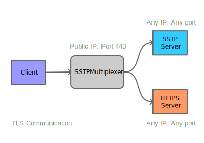

# SSTP / HTTP Multiplexer

Tool to serve **HTTPS** and **SSTP** on same port and ip, for unix systems.  
Simple one file php program, with ready-made install scripts for ubuntu. Also, it's kind of reverse proxy, so, use with caution please.  
> If you are using this tool, I'll be happy when you leave a star, to keep this project alive 😇

## Installation

Prequisities:
 - Unix based system (support of pcntl, wsl should be good)
 - Php 7.4 +
 - systemd (optional, for service automation)

Run following commands: 

~~~bash
# Download and install: 
git clone https://github.com/toomeenoo/SSTP-HTTP-Multiplexer
cd SSTP-HTTP-Multiplexer
# Edit config.ini to your needs, then
php SSTPMultiplexer.php
~~~
If you are familiar with systemd, edit paths in `sstp-multiplexer.service` accordingly, and enable this service.  
If you are not, all you need to do, is to run `php SSTPMultiplexer.php` in the background, and make sure that it stays runnng, or make it auto start again on failure.

### Install on Ubuntu

For ubuntu there are pre-written install and unistall scripts, so you should be good playing with this, without messing things up.   
First, make sure you have git and php installed: 
~~~bash
sudo apt update && sudo apt upgrade
sudo apt install php git
~~~
Then, it goes like this:  
~~~bash
# Download and install: 
git clone https://github.com/toomeenoo/SSTP-HTTP-Multiplexer
cd SSTP-HTTP-Multiplexer
bash ./ubuntu_install.sh

# Edit config:
sudo nano /etc/sstpmultipler/config.ini

# Service controll:
sudo systemctl restart sstp-multiplexer

# In same directory for uninstall:
bash ./ubuntu_uninstall.sh
~~~
SSTPMultiplexer.php will be copied into `/usr/local/sstpmultipler`  
It needs root privileges for creating service units and accessing restricted folders.  
Not sure about it, but it will possibly work on debian too.

### Configure
Primary location for simple `config.ini` is in `/etc/sstpmultipler/config.ini`, with fallback to directory where `SSTPMultiplexer.php` is located.

### Important notes - when it does not work

 - Windows build-in SSTP client requires SSL certificates to be valid, with mathing and valid CN (hostname).
 - Using ports under `1024` requires running as root
 - Reading certificates directly from *(Let's Encrypt's)* `certbot` certificates requires either root permission, or change acces mode on files. *Usually are located in `/etc/letsencrypt/live/{HOSTNAME}/[fullchain|privkey].pem` respectively* 
 - When something does not work:
   - Stop service if is runnging
   - Change `log_stdio` to `1` in configuration file
   - Manually start `php SSTPMultiplexer.php` in it's directory and watch

## About software

- Tested on:
  - SSTP client: Windows 11 23H2
  - SSTP server: [Softether 5.01](https://github.com/SoftEtherVPN/SoftEtherVPN)
  - HTTP client: Firefox 126.0
  - HTTP server: Apache/2.4.59 (Ubuntu 20.04)
  - Multiplexer on: Ubuntu 20.04, PHP 7.4.33
  - Tested with valid SSL certificates by Let's Encrypt 

- Not tested:
  - SSTP Certificate authentication (only basic, name + passowrd)

- Known quirks:
  - Real IP address of requestor (client) is not forwarded to HTTP server.
  - Connections from Multiplexer to HTTP and SSTP servers are in "Unsecure" mode, no checking for valid certificate or valid certificate name are in place - intended to be in safe LAN environment with static addresses.
  - Only TCP communication supported, not intended for use with QUIC protocol

